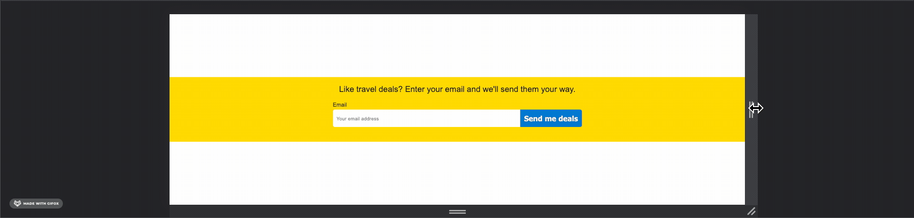

# Subscribe Form
A simple, responsive form that would accept an email address and add a user to a newsletter.

**Source**


**End Product**



## My Approach
I wanted to try my hand at a simple form component so that I could understand the basics of form markup and layout. This component is simple enough as it only requires the user to enter an email address. Since this is a CSS-only project, all validation is done by the browser and the data isn't sent anywhere. I'm planning a future project where the form is validated using some JavaScript as well. A later iteration could also send the data to an actual server.

## Challenges
Inspecting the page that inspired this component, I realized that the `min()` function can be used as an alternative to multiple media queries that controle size. For example, instead of this...
```
.registration-container {
  max-width: 76rem;
}
...

@media only screen and (max-width: 759px) {
  .registration-container {
    max-width: 100%;
  }
}
```

...you can just use one declaration:
```
.registration-container {
  max-width: min(100%, 76rem);
}
```
The function will assign the smaller value to the `max-width` property. As soon as the viewport becomes smaller than 76rems, 100% is a smaller value and is thereby assigned. This makes for simple responsive behavior with flatter CSS. 
